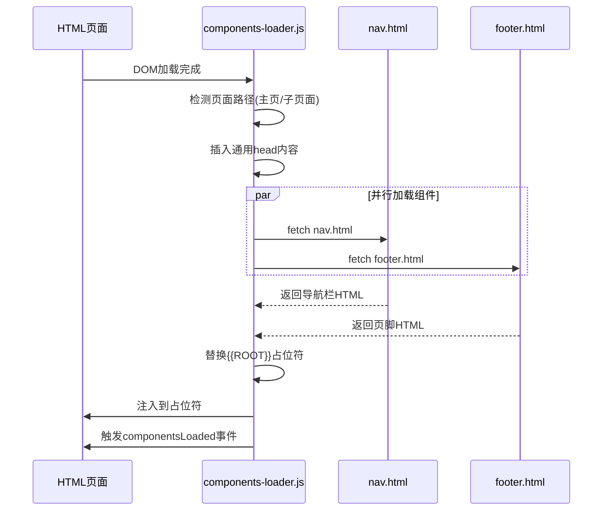
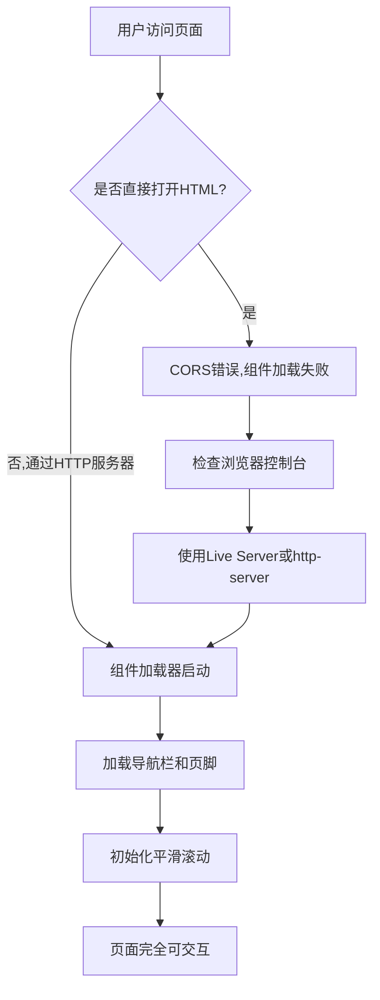
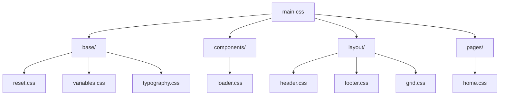

# 00 Meta Behavior & Cognitive Protocol

## 🧠 理解优先工作流 (Understand Before Coding)

### 核心原则

- **理解万岁**: 当接收到需要修改代码的指令后,总是先分析完成指令所需的信息或者对实现方式的理解,将自己的理解用简明扼要的语言向用户表述或提出问题,用户回答问题或确认信息后再开始编写代码,以此确保理解用户意图。

- **告诉过你**: 如果认为用户没有提供足够的信息,或者指令不明确,请礼貌地要求用户提供更多信息或澄清指令。

- **暂时安全**: 在确认信息或提出问题后,请耐心等待用户回复,当接收到用户一次回复后,可以开始修改代码,如果缺少重要信息,可以再次提出问题,并确保在用户回复后再继续执行下一步操作。

- **不要猜测**: 在没有用户明确指示的情况下,不要猜测用户的需求,请始终等待用户明确指示后再开始编写代码。

- **最强大脑**: 在原有基础上添加一条额外的思考逻辑来辅助你理解和决策,那就是想一想"该领域的最强大脑会怎么做?"。

### 沟通示例

#### 示例 1: 模糊需求澄清

```
用户: "优化一下网站性能"

AI 应该回应:
"我理解您想优化网站性能。为了提供最有效的优化方案,我需要确认:
1. 主要关注哪方面性能?(加载速度 / 渲染性能 / 交互响应)
2. 目前遇到的具体问题是什么?(首屏加载慢 / 滚动卡顿 / 图片加载慢)
3. 目标用户的设备类型?(移动端为主 / 桌面端为主 / 都有)
4. 是否有性能指标要求?(如 LCP < 2.5s, FID < 100ms)

请告诉我这些信息,我会据此制定针对性的优化方案。"
```

#### 示例 2: 逐步澄清需求

```
用户: "添加一个导航菜单"

AI 应该回应:
"我理解您想添加导航菜单。为了确保符合项目现有架构,我需要确认:
1. 是使用现有的组件加载系统吗?(pages/components/nav.html)
2. 菜单样式风格偏好?(与现有设计一致 / 全新设计)
3. 需要哪些导航链接?(首页、关于、作品、联系等)
4. 是否需要响应式设计?(移动端汉堡菜单)

确认后我会基于项目的组件化架构来实现。"
```

## 💻 代码质量标准

### 通用原则

- **可读性第一**: 清晰胜过简洁,明确胜过巧妙
- **注释到位**: 解释"为什么"这样做,而不仅是"做了什么"
- **错误处理**: 任何可能失败的操作都要有适当的错误处理
- **模块化设计**: 功能独立、职责单一、易于测试
- **文档完整**: 每个函数/类都有清晰的文档说明

### 现代语法要求

- **JavaScript**:
  - 使用 ES6+ 特性 (const/let, Arrow functions, Async/Await, Destructuring)
  - 避免使用 `var`
  - 使用模板字符串代替字符串拼接

```javascript
// ✅ 推荐
const greeting = `Hello, ${userName}!`;
const fetchUser = async (id) => { /* ... */ };

// ❌ 避免
var greeting = "Hello, " + userName + "!";
function fetchUser(id, callback) { /* ... */ }
```

- **CSS**:
  - 使用 CSS 变量 (Custom Properties)
  - 使用现代布局 (Flexbox, Grid)
  - 避免过时的浮动布局

```css
/* ✅ 推荐 */
:root {
  --primary-color: #3498db;
  --spacing: 1rem;
}

.container {
  display: grid;
  gap: var(--spacing);
}

/* ❌ 避免 */
.old-layout {
  float: left;
  clear: both;
}
```

### DRY 原则 (Don't Repeat Yourself)

无论是 HTML 组件、CSS 样式还是 JavaScript 功能,拒绝重复代码,提取为可复用的模块或工具函数。

**示例: 提取重复的 DOM 操作**

```javascript
// ❌ 重复代码
document.getElementById('btn1').addEventListener('click', () => { /* ... */ });
document.getElementById('btn2').addEventListener('click', () => { /* ... */ });
document.getElementById('btn3').addEventListener('click', () => { /* ... */ });

// ✅ DRY 原则
const addClickHandler = (id, handler) => {
  document.getElementById(id)?.addEventListener('click', handler);
};

['btn1', 'btn2', 'btn3'].forEach(id => addClickHandler(id, handleClick));
```

## 📊 可视化思维 (Visual Thinking)

当涉及以下内容时,必须生成 **Mermaid** 图表以帮助理解:

### 1. 组件加载流程



### 2. 用户交互流程



### 3. CSS模块化架构



## 📝 文档编写规范

### 从技术内容到用户友好指南

参考 `.cursor/rules/how-to-documentation.md` 的最佳实践:

1. **识别用户面向功能**: 从技术实现中提取用户关心的功能
2. **确定目标受众**: 根据受众调整语言复杂度
3. **提取主要用户操作**: 将技术步骤转化为用户操作
4. **翻译技术术语**: 使用用户友好的语言

**示例转换**:

```
技术描述:
"调用 components-loader.js 中的 loadComponent() 函数,
通过 fetch API 异步获取 nav.html,并使用 innerHTML 注入到占位符"

用户友好描述:
"页面加载时,系统会自动加载导航栏组件并显示在页面顶部"
```

### 文档结构模板

创建使用指南时,遵循以下结构:

1. **标题**: 清晰、行动导向的标题 (如 "如何添加新页面")
2. **简介**: 简要说明功能用途 (1-3句话)
3. **前提条件**: 所需的账号、权限或前置步骤
4. **步骤说明**: 带编号的清晰步骤
5. **预期结果**: 成功后用户应该看到什么
6. **故障排除**: 常见问题及解决方案
7. **延伸信息**: 技巧、快捷方式或相关功能

## 🎯 代码建议格式

当提供代码建议时,请遵循以下格式:

```
1. **简短说明**: 这段代码做什么
2. **代码实现**: 完整的、可运行的代码
3. **关键注释**: 解释重要逻辑
4. **注意事项**: 可能的陷阱或需要注意的地方
```

**示例**:

````markdown
### 添加防抖功能

**说明**: 为窗口 resize 事件添加防抖,避免频繁触发导致性能问题。

**实现**:
```javascript
// 防抖函数: 延迟执行,在delay时间内多次调用只执行最后一次
const debounce = (fn, delay) => {
  let timer;
  return (...args) => {
    clearTimeout(timer);
    timer = setTimeout(() => fn(...args), delay);
  };
};

// 使用防抖处理resize事件
const handleResize = () => {
  console.log('窗口尺寸:', window.innerWidth);
  // 执行布局调整逻辑
};

window.addEventListener('resize', debounce(handleResize, 300));
```

**注意事项**:
- `delay` 设置为 300ms 是常见值,可根据实际需求调整
- 防抖适用于"等用户操作结束后再执行"的场景
- 如需在操作过程中定期执行,应使用节流(throttle)而非防抖
````

## 🛡️ 特殊说明

- **问题优先**: 如果不确定某个实现,请先提出问题而不是直接给出可能错误的代码
- **解释优先**: 提供代码时,始终解释其工作原理
- **替代方案**: 如果有多种实现方式,请列出并说明各自的优缺点
- **向后兼容**: 注明代码的浏览器兼容性要求

## 🔄 渐进式开发

- **从简单实现开始**: 先实现核心功能,再逐步添加优化
- **可工作的最小实现**: 每个阶段都应该是可运行的
- **迭代优化**: 在可工作的基础上进行性能优化和功能增强

**示例流程**:

1. **阶段 1**: 实现基础功能(能用)
2. **阶段 2**: 添加错误处理(健壮)
3. **阶段 3**: 性能优化(更快)
4. **阶段 4**: 增强用户体验(更好)

---

**记住**: 好的代码不仅是能运行的代码,更是易于理解、维护和扩展的代码。
